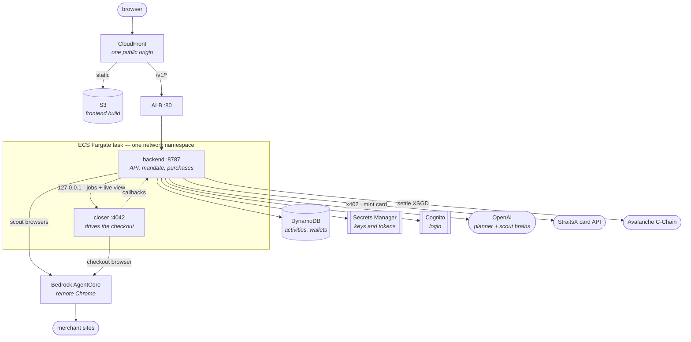
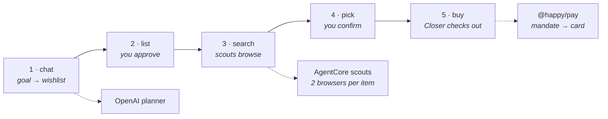
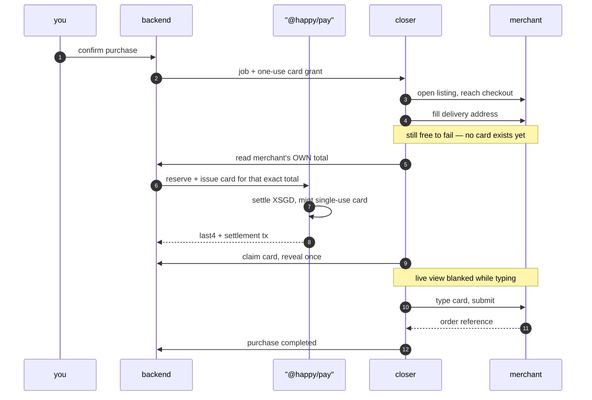

# Architecture

Two views: what runs on AWS, and what happens when someone asks Happy to buy something.
For the money library's internals see [`packages/pay/ARCHITECTURE.md`](packages/pay/ARCHITECTURE.md).

## 1. What runs on AWS

One CloudFront distribution is the only public entrance. Static files come from S3; every
`/v1/*` path goes to the ALB. The backend and the Closer share a single Fargate task, so the
Closer needs no route of its own — anything that can reach it can spend money.

Notes that matter more than the boxes:

- **The Closer is unroutable from outside.** Its only inbound client is the backend over
  loopback. The one exception is the live view, proxied read-only through
  `/v1/closer/v1/live/*` with an allowlist that admits nothing else.
- **The ledger is on the container filesystem.** A task restart loses it, and with it
  reconciliation's ability to recover an in-flight payment. Acceptable on a test rail; the
  real limitation of this topology on mainnet.
- **Chain id decides whether money is real.** `43113` + sandbox card API is a test purchase;
  `43114` + production is real XSGD with no refunds. `/v1/health` reports which is live and
  Settings shows it as a badge.

## 2. What happens when you ask for something

Five stages. Everything before the card is minted is free to fail and retry; everything after
it is spending real value, which is why the order below never changes.

The buy stage in detail, because that is where money moves:

Why it is ordered that way:

- **The total is read from the merchant's page, not the shortlist.** A shop that nudges its
  price between picking and paying would otherwise be paid whatever it asked for.
- **The card is minted for that exact total**, single-use, and dies on first authorisation.
- **The address goes in before the card**, so a checkout that rejects the address costs a
  retry rather than a live card.
- **The live view blanks across card entry.** Nothing that renders the number reaches a viewer.
- **Spend counts at issuance, not completion.** On a prepaid rail, minting *is* the spend.

## 3. Where the code lives

| Path | What |
|---|---|
| `frontend/` | React app — chat, search view, purchase execution, settings |
| `backend/` | API, activity state machine, mandate enforcement, provider wiring |
| `packages/pay` | Mandate ledger, x402 settlement, card issuance, reconciliation |
| `packages/closer` | Purchase service — browser, checkout, address, card entry |
| `packages/shared` | Money units, bigint-only |
| `terraform/` | The AWS stack above |
