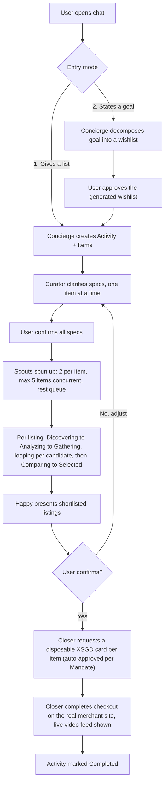

# Happy — AI Shopping Concierge
### Product & System Spec — Draft v0.3

Context: StraitX/StraitsX hackathon. AI agents research and purchase real items on a user's
behalf, paying with a disposable, single-use virtual card funded in XSGD (StraitsX's
SGD-pegged stablecoin).

**Changelog v0.1 → v0.2:** all v0.1 open questions resolved and folded in below. A few new,
narrower implementation questions surfaced along the way — flagged **[OPEN]**.

**Changelog v0.2 → v0.3:** the payment layer is now built and merged (`packages/pay`, the
`@happy/pay` library). §9, §10 and §11 are updated to match what actually shipped rather than
what was planned. Three things changed materially and the Closer's design depends on them:

1. **The card is bought at the payment page, not when the item is confirmed.** It expires in
   about ten minutes and the money is irreversible, so issuing early strands funds.
2. **Retry-then-next-best (§9) only works *before* the card is issued.** Once a card exists for
   an item, falling back to another listing means abandoning that money — there is no refund
   path on this rail. The retry ladder has to run at checkout-navigation time.
3. **The Closer never sees a card number.** It hands the payment library a browser page and the
   library fills the form itself.

New in v0.3: §12, the payment layer's actual API and the rules the Closer must follow.

---

## 1. One-line pitch

Happy is a chat-first shopping assistant: tell it what you want — a parts list, or just a goal —
and a small swarm of AI agents researches, compares, and (with your confirmation) buys it on
real merchant sites, paying with a disposable virtual card issued against your XSGD wallet.

---

## 2. The cast of agents

| Name | Role |
|---|---|
| **Concierge** | Root orchestrator. Reads the user's request, decides whether it's already a list or a goal that needs decomposing, creates the Activity, and hands each item to the Curator. |
| **Curator** | Works with the user, per item, to turn a vague want ("RAM") into a locked spec ("16GB DDR5-5600, black heatsink") — presents real options with images and asks for clarification. |
| **Scouts** | 2 assigned per item, up to 5 items processed concurrently (10 Scouts running at once, matching the max-10-per-Activity cap). Each browses real listings and scores candidates on Price, Authenticity, and Reviews. |
| **Closer** | Executes the purchase once the user confirms the shortlist: requests the disposable XSGD card and completes checkout on the real merchant site. |

Placeholder names chosen to fit Happy's "helpful concierge" tone — swap freely.

---

## 3. Screens / information architecture

- **Sign in** (email-based — password or magic link) → **Dashboard**
- **Dashboard** (= the "Purchase" tab, default landing screen)
  - Left nav: **Purchase** (home) · **Wallet** · **Mandate** · **Settings** — icon + label
    sidebar, collapsible (similar in spirit to the Jira-style sidebar you referenced).
  - Top bar: profile avatar → **Profile** page.
  - Center: chat window — entry point for starting a new Activity.
  - Right: Activity feed — every ongoing/past Activity as a card (title, current state with
    icon/color, timestamp).
- **Wallet** — XSGD balance, top-up flow, transaction history, issued-card log (confirmed scope).
- **Mandate** — spend caps + **auto-approve** (on by default — see §9).
- **Settings** — profile fields, linked wallet, notifications.
- **Profile** — user details, linked wallet address, sign out.

---

## 4. End-to-end flow



---

## 5. Starting a workflow — 2 entry modes

**Mode 1 — Explicit list.** User pastes/types a list of items. Concierge parses it into discrete
Items and hands straight to the Curator.

**Mode 2 — Goal statement.** User describes an outcome ("build me a gaming PC for $1,500").
Concierge decomposes it into a materials wishlist and **shows it to the user for approval**
before anything moves to the Curator. Editing the wishlist at this stage (add/remove/rename an
item) should be supported before the user hits "approve."

Either mode immediately creates a new **Activity** card in the right-hand feed, in `clarifying`
state.

---

## 6. Item clarification — the Curator

For each Item, Curator:
1. Asks any necessary clarifying questions (budget, brand, aesthetic, etc.)
2. Presents 2–4 concrete real-world options with images, price range, and a one-line "why this"
3. Locks the item's spec once the user picks/confirms

Items stay visible as a running list; the user can revisit and edit any item's spec before all
items move forward together to search.

---

## 7. Multi-agent search — the Scouts

- **2 Scouts per item.** **Up to 5 items processed concurrently** (10 Scouts running at once —
  this is where your original "max 10 agents per Activity" cap comes from). Additional items
  beyond the first 5 sit in a queue and start as soon as a slot frees up (an item's pair of
  Scouts finish and both move to `Selected` or `failed`).
- **[OPEN]** What should differentiate the two Scouts on the same item — e.g. each pulls from a
  different pool of marketplaces/sources for coverage, different search-query strategies, or
  one is a straightforward backup for the other? Proposed default if no preference: split by
  source pool (e.g. Scout A favors large marketplaces, Scout B favors specialist/independent
  sellers), so the two don't just duplicate each other's work. Both Scouts' gathered listings
  feed into the same shared candidate pool for that item at the Comparing stage.
- Candidates are evaluated on: **Price**, **Authenticity** (seller reputation, listing red
  flags), **Reviews** (rating, volume, sentiment).

### Stage pipeline — clarified

`Pending → Discovering → Analyzing → Gathering → (loop) → Comparing → Selected`

| Stage | Meaning |
|---|---|
| Pending | Scout assigned to the item, not yet started |
| Discovering | Scout clicks into a specific candidate listing |
| Analyzing | Scout checks whether *this* listing is actually relevant to the locked spec |
| Gathering | Scout extracts that listing's URL + details and stores them in Happy for later comparison |
| *(loop)* | If more candidates are wanted, Scout returns to **Discovering** for the next listing — this is the back-and-forth motion you described. Repeats per candidate. |
| Comparing | Once enough listings are gathered for the item, all stored candidates (from both Scouts) are compared against each other |
| Selected | Best candidate locked; URL + details recorded |

**[OPEN — proposed default]** How many listings should be gathered per item before moving to
Comparing? Defaulting to **3 per Scout (6 total per item)** unless you'd rather tune this per
item or let it vary by category. Happy to adjust.

### Live feed — real video, not just text

Confirmed: this should be an actual live video stream of each Scout's browser session, not a
text log. Each Scout runs its own automated browser session; the feed shows a real-time tile per
agent (small live view, color-coded to the item, click to expand). A short status line
(item · stage) can overlay the video for context, but the video itself is the primary content.

Implementation notes for the engineering team:
- Each Scout's browser session needs a way to stream its viewport out — e.g. Chrome DevTools
  Protocol screencast frames, or a headless-browser video capture, relayed to the frontend over
  a WebSocket and rendered as a live-updating image/canvas (cheaper) or true video (more
  expensive, smoother).
- At full load (5 items × 2 Scouts = 10 concurrent sessions), 10 simultaneous live streams is a
  real bandwidth/compute cost. Worth deciding up front whether it's full video or a
  lower-frame-rate screenshot stream that still reads as "live." **[OPEN]**
- The Mandate/auto-approve setting doesn't reduce this — the live feed should stay visible
  through search regardless of approval mode, since it's for observability, not for approval.

### Progress visualization

- Each Item has its own color.
- A **collective progress bar** shows every item's stage as a colored dot on one shared track
  (the 5 stops: Discovering / Analyzing / Gathering / Comparing / Selected).
- Dots animate smoothly between stops, including the genuine back-and-forth loop
  (Gathering → Discovering) as a Scout works through multiple candidates before Comparing.

---

## 8. Presenting listings & confirmation

Once every item reaches `Selected`, Happy presents one listing per item (image, price, seller,
why-this-one) in the chat. The user can:
- **Confirm all** → proceeds to purchase
- **Reject one item** → sends that item's Scouts back to Discovering with feedback

---

## 9. Purchase — the Closer, real merchants, and the XSGD/StraitsX payment layer

**Confirmed scope: real merchant sites, real checkout.** Worth being upfront about what that
actually takes, since it's the highest-risk part of the build:

- Automating checkout across *arbitrary* real merchant sites will run into anti-automation
  measures on plenty of them — CAPTCHAs, device/bot fingerprinting, mandatory account
  login, one-time SMS codes, etc. This isn't a Happy-specific problem; it's true of browser
  automation generally, and neither Claude nor most agent frameworks build tooling to bypass
  CAPTCHAs or bot detection — that's worth ruling out as a strategy rather than budgeting time
  for it.
- The practical path to "real, working" purchases: prioritize merchants/listings reachable
  through an **official cart or checkout API** where one exists (Shopify Storefront API,
  WooCommerce REST API, marketplace affiliate/checkout APIs, etc.) — those are fully automatable
  without a bot-detection fight. For listings on sites without an API, plan for **graceful
  degradation**: Closer attempts the automated checkout, and if it hits a CAPTCHA/login wall,
  falls back to handing the user the pre-filled cart + the one-time card view to finish the last
  step themselves, rather than getting stuck retrying indefinitely.
- **[OPEN]** Worth deciding which specific merchants/marketplaces are actually in scope for the
  hackathon demo — that determines how much of the "real functionality" is API-backed vs.
  browser automation, and therefore how much of it is reliably automatable in the time you have.

**Card handling (confirmed): one disposable card per item**, requested at the moment that item
is purchased. Cards from the reference StraitsX infrastructure are single-use, one-view only,
and capped between 5 and 30 SGD, settled on-chain via an EIP-3009 authorization.

**As built (v0.3) — four constraints the Closer inherits:**

- **S$5–S$30 per card is a hard floor and ceiling**, enforced by the rail itself (verified: 4 →
  HTTP 400, 5 → OK, 30 → OK, 31 → HTTP 400). An item whose all-in total falls outside that band
  cannot be bought at all. Filter candidates on it during Comparing, not at checkout.
- **The total must include shipping and tax.** The mandate is re-checked against the final
  charge, not the listing price, and anything more than 2% above the quoted price is refused —
  which is exactly the "price moved above the cap" protection described above, now implemented.
- **Issue the card only once the browser is on the payment page.** It dies roughly ten minutes
  after issuance, and the money leaves the wallet the moment it is minted.
- **Fractional amounts work.** A card can be minted for S$18.50 exactly; no rounding needed.

**Mandate / auto-approve (confirmed: on by default).** The shortlist confirmation in §8 is still
the one moment the user explicitly signs off, per Activity. With auto-approve on, Closer doesn't
pause again for a second approval before each individual card is issued during purchase — it
proceeds through the confirmed items in sequence. Mandate should still let the user set:
- Per-item spend cap
- Per-activity total spend cap
- The auto-approve toggle itself (so it can be switched off to require per-card approval)
- Category allow/deny rules (optional, lower priority)

If a listing's price moves *above* the cap between confirmation and purchase, Closer should stop
and notify rather than silently overspending — auto-approve covers routine execution, not
exceeding a limit the user set.

**Failure handling (confirmed): auto-retry, then auto-pick next-best.** Per item:
1. Retry the same listing/checkout step a small number of times (e.g. once or twice).
2. If it still fails (out of stock, checkout error, bot-check that can't be cleared), fall back
   automatically to the next-best gathered candidate from that item's Comparing results and
   retry checkout with that one.
3. Only surface a failure to the user if every gathered candidate for that item has been tried
   and failed.

> **v0.3 — the retry ladder must run before the card is issued.** Steps 1 and 2 assume falling
> back is free. It isn't, once money has moved: a card is minted for one specific charge on one
> specific merchant, and abandoning it to try the next-best listing abandons the funds with it.
> There is no refund path on this rail.
>
> So the ladder splits in two. **Before `issueCard`** — navigating, adding to cart, reaching the
> payment page — retry and fall back freely, as many candidates as you like; nothing has been
> spent. **After `issueCard`** — only the *same* checkout may be retried, and only until that
> card's ~10-minute life runs out. If it cannot be completed, the purchase is recorded as
> `STRANDED` with the amount still counted as spent, and the next-best candidate needs a fresh
> card and a fresh mandate check.
>
> Practically: get all the way to the payment form, *then* ask for the card. A failure at any
> earlier step costs nothing.

Items are purchased **in sequence**, not in parallel, with the live feed showing which item
Closer is currently working on (same live-video treatment as Scouts, ideally — watching the
actual checkout happen is the point).

Source: StraitsX MCP Card Gateway reference stack (SMU hackathon) —
https://glama.ai/mcp/servers/anishnar/straitsX-mcp-demo

---

## 10. Data model (sketch)

```ts
User        { id, name, email, walletAddress, avatarUrl }

Activity    { id, userId, title, entryMode: 'list' | 'goal',
              status: 'clarifying' | 'searching' | 'awaiting_confirmation'
                    | 'purchasing' | 'completed' | 'failed' | 'cancelled',
              itemsInProgress: string[],   // item ids, max 5
              itemsQueued: string[],       // item ids waiting for a Scout slot
              createdAt, updatedAt, items: Item[] }

Item        { id, activityId, name, colorTag,
              specs: Record<string, string>,
              stage: 'pending' | 'discovering' | 'analyzing' | 'gathering'
                   | 'comparing' | 'selected' | 'purchased' | 'failed',
              scoutIds: [string, string],       // 2 per item
              candidateListings: Listing[],      // pooled from both Scouts
              minListingsBeforeComparing: number, // default 3 per Scout
              selectedListingId, priceCapSGD? }

Listing     { id, itemId, scoutId, url, title, imageUrl, priceSGD, seller,
              authenticityScore, ratingAvg, reviewCount, scoutNotes }

ScoutAgent  { id, itemId, activityId, stage,
              currentListingUrl,          // what it's on right now
              listingsGathered: number,   // progress toward the threshold
              liveStreamUrl }             // live video feed for this session

DisposableCard { id, activityId, itemId, cardOpaqueId, amountSGD, // 5-30
                 cardholderName, settlementTx, viewUrl, // one-time
                 status: 'issued' | 'viewed' | 'used' | 'expired', issuedAt }

WalletTx    { id, userId, type: 'topup' | 'card_issue' | 'settlement',
              amountSGD, txHash, timestamp }

Mandate     { id, userId, perItemCapSGD, activityBudgetCapSGD,
              autoApprove: boolean,           // default true
              categoryAllowlist: string[], categoryDenylist: string[],
              updatedAt }
```

### v0.3 — what the payment layer actually stores

The sketch above is the product's view. `@happy/pay` owns the money records and its shapes
differ in ways worth reconciling before the UI binds to them:

```ts
// All amounts are INTEGER CENTS. Never a float — 1850 is S$18.50.
Mandate     { id, perItemCents, dailyCents, merchants: string[], expiresAt,
              status: 'ACTIVE' | 'EXPIRED' | 'REVOKED',
              spentCents, reservedCents, remainingCents, strandedCents,
              limits: { minCardCents, maxCardCents },   // the rail's 500–3000
              footer }   // prerendered UI string, so displayed numbers can't drift

Purchase    { id, state, itemName, merchantHost, quotedCents, finalCents,
              orderRef, last4, settlementTx, createdAt }
// state: RESERVED → PAYING → CARD_ISSUED → DONE
//        plus RELEASED (budget returned), STRANDED (money spent, nothing bought), FAILED
```

Reconciling the two:

| Product sketch | As built | Note |
|---|---|---|
| `perItemCapSGD` | `perItemCents` | Cents, not SGD floats. Doubles as the auto-approve threshold. |
| `activityBudgetCapSGD` | `dailyCents` | **Rolling 24h, not per-Activity.** If per-Activity is wanted, that's a real change — say so. |
| `autoApprove: boolean` | *implicit* | Under the per-item cap → proceeds alone. Over it → `NEEDS_HUMAN`, and issuance is refused until `approve()` is called. Turning auto-approve "off" = setting `perItemCents` to 0. |
| `categoryAllowlist/Denylist` | not built | `merchants` is a host allowlist instead. An empty list denies everything — fail-closed. |
| — | `expiresAt` | New: mandates expire. The product has no UI for it yet. |
| `DisposableCard.status` | `ACTIVE / SPENT / DEAD` | Plus `last4` only — the number is never stored. |
| `WalletTx` | not built | No top-up flow exists; the wallet is funded by the organisers. |

There is also an append-only audit log — every state change, readable per purchase — which is
what backs the "audit & revoke" leg of StraitsX's own mandate model.

---

## 11. Remaining open questions

Everything from v0.1 is resolved. What's left is narrower and mostly implementation-level:

1. What differentiates the two Scouts on the same item? (proposed default: split by source pool)
2. Minimum listings gathered before Comparing — proposed default 3 per Scout (6 total per item)?
3. Which specific merchants/marketplaces are in scope for the demo — determines how much of
   checkout is API-backed vs. browser automation, and the fallback behavior when a real site
   blocks automated checkout.
4. Live feed: true video stream, or a lower-frame-rate screenshot stream (cheaper at 10
   concurrent sessions, still reads as "live")?

### v0.3 — findings on question 3

Still the biggest open risk, but narrower now. What was checked:

- **There is no programmatic checkout path for arbitrary merchants.** Stripe/OpenAI's Agentic
  Commerce Protocol needs the *merchant* to integrate and pays with its own tokens, not a card
  we hold. OpenAI's Instant Checkout was retired in March 2026. Visa Intelligent Commerce and
  Mastercard Agent Pay are tokenised-credential schemes requiring issuer and merchant enrolment.
  None of them accepts a PAN we were handed.
- **Shopify Storefront / WooCommerce REST only work on stores you control** — which the
  hackathon rules score as a simulation, not a real purchase.
- So checkout is browser automation, and the card is typed in. That is already built and tested.
- **The live risk is 3DS.** Singapore mandates OTP/3DS on SG-issued cards at 3DS-enrolled
  merchants. Whether this card is enrolled, and what billing address it carries for address
  verification, decides which merchants are usable **at all** — and neither is documented. This
  is the single question most worth getting answered by StraitsX before committing to a merchant.
- Merchant selection criteria, in priority order: guest checkout with no account or OTP; no 3DS
  challenge; all-in total landing S$5–S$30; ships to a real SG address; tolerant address
  verification.

**Recommendation:** pick one merchant, write deterministic selectors for its payment form, and
rehearse it. The card-filling code finds fields by `autocomplete="cc-*"` first, so it works on
ordinary markup — but "works on one known site, reliably" beats "works on any site, sometimes"
when the judges ask for a live re-run.

---

## 12. Payment layer — as built (v0.3)

`packages/pay`, imported as `@happy/pay`. A library, not a service: the Closer calls functions
in-process. There is no HTTP API and no port to run.

### What the Closer does, per item

```ts
import { evaluate, reserve, issueCard, payWithCard, complete, cancel } from '@happy/pay';

// 1. Free, no side effects. Call it while comparing candidates.
if ((await evaluate(q)).decision !== 'ALLOW') return;   // try the next candidate

// 2. Holds the budget. Still no money moved.
const p = await reserve(q);

// 3. Navigate to the payment form. Retry / fall back to other listings freely here.
//    Read the FINAL total off the page — including shipping and tax.

// 4. Money leaves, irreversibly. Only from the payment page.
await issueCard(p.id, finalTotalCents);

// 5. The library fills the card in. The Closer never sees a number.
const { ok, orderRef } = await payWithCard(page, p.id);

ok ? await complete(p.id, orderRef ?? null) : await cancel(p.id, 'checkout_failed');
```

A quote is `{ amountCents, merchantHost, itemName, productUrl? }`.

### Decisions it can return

`ALLOW` · `NEEDS_HUMAN` (over the per-item cap — needs `approve()` first) · `DENY` with a reason:
mandate expired or revoked, merchant not on the allowlist, over the daily cap, below the rail's
S$5 floor, above its S$30 ceiling, not enough XSGD, chain data stale, price moved beyond
tolerance, rail rate-limited.

`BELOW_RAIL_MINIMUM` and `ABOVE_RAIL_MAXIMUM` are the two the Scouts should filter on during
Comparing, so an unbuyable candidate never reaches the Closer.

### What it guarantees

- **It cannot pay twice.** The signed payment is written to disk before it is sent, so a crash
  mid-flight is identified on-chain afterwards and either recovered or recorded — never re-paid.
- **It cannot overspend the mandate.** The rules are re-checked against the final charge, with
  human approval required above the per-item cap even if the quote was under it.
- **Card numbers never reach the agent.** Not in its context, not in logs, not in the audit
  trail, not in any return value.
- **It never polls the payment rail.** That rail rate-limits after roughly a dozen requests and
  the budget is shared with every other team at the venue.

### What it deliberately does not do

Baskets (one card, one item), refunds (the rail has none), automatic retry onto a second card,
splitting a purchase above S$30 across several cards, and any HTTP wrapper.

### Running it

`ISSUER=mock` is the default and needs nothing — no keys, no funding, no network. The whole
flow, including a local storefront and a hostile product page for demonstrating prompt-injection
resistance, runs offline. `ISSUER=straitsx` plus `SPEND_PRIVATE_KEY` is the only switch to real
money, and should stay off until the demo.
