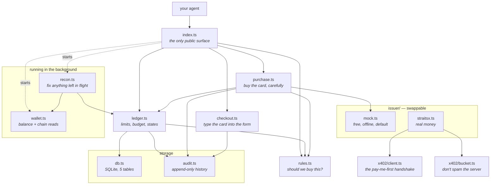
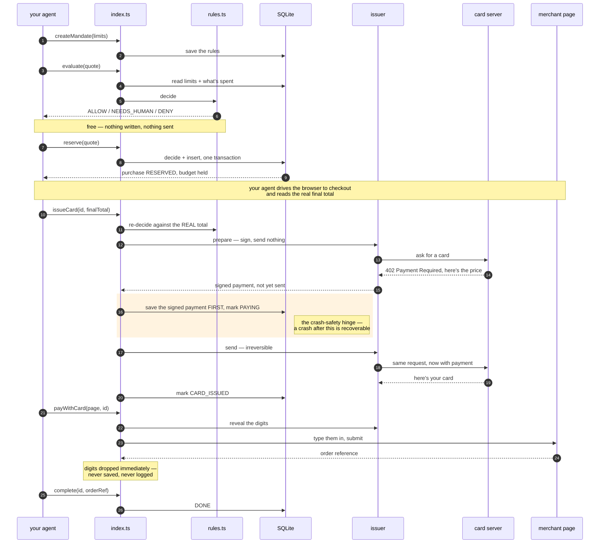
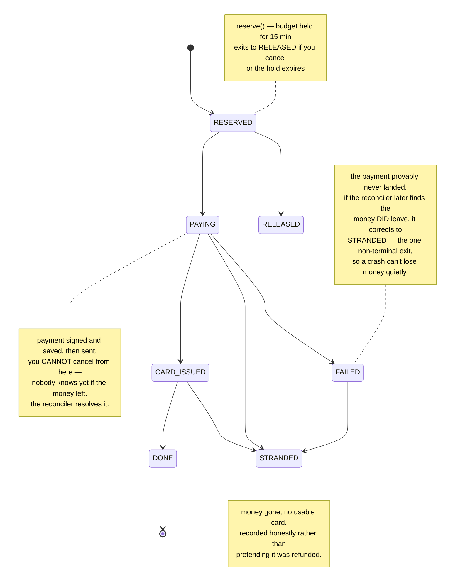
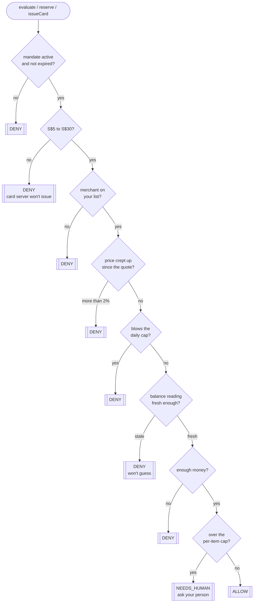
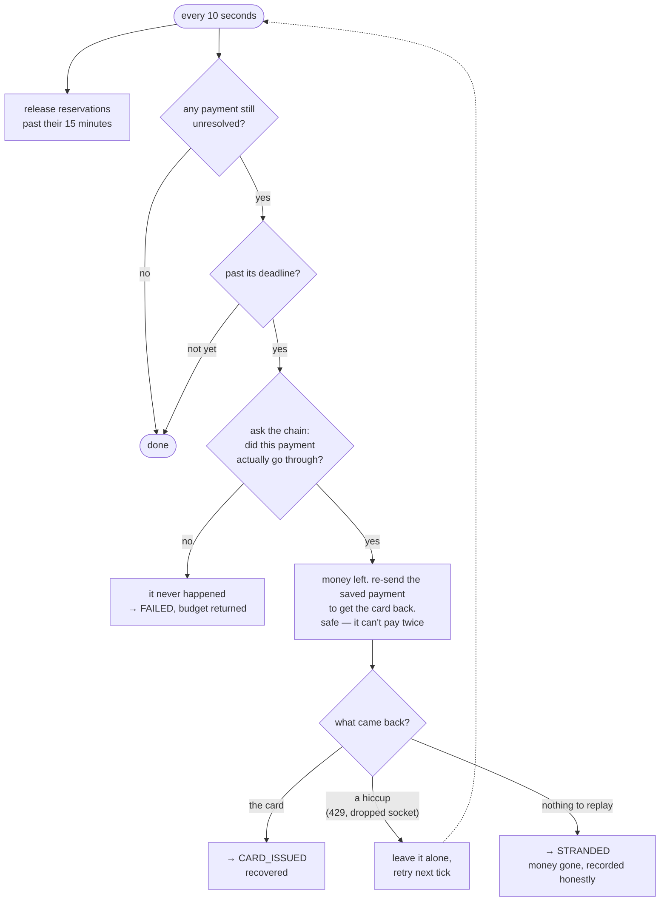

# How @happy/pay works
## 1. The files

Your agent only ever touches `index.ts`. Everything below it is internal.

## 2. One purchase, start to finish

The happy path. Note where money actually moves — step 9, and nowhere else.

## 3. What state is a purchase in?

## 4. The decision

Every gate in `rules.ts`, in order. First match wins. No database, no network — just this.

The price check only runs at `issueCard` time, when there's a quote to compare against.

**`NEEDS_HUMAN` is a gate, not a warning.** At `issueCard` the decision runs again against the
real total, and if it comes back `NEEDS_HUMAN` the purchase is refused unless `approve()` was
called for it. That matters because the quote can be under your per-item cap while the final
charge is over it — a merchant nudging the price up between the two would otherwise buy a card
above the limit with nobody asked.

**One more safety net at issuance.** The raw response from the card server is written to
`card-responses/<nonce>.json` (owner-only, gitignored) *before* anything tries to parse it.
Nobody has seen a real success response from that endpoint, so the code that extracts the card
number is working from an educated guess — if it guesses wrong, the file is the difference
between "money gone, card unreadable" and "money spent, digits on disk, type them in by hand."
Delete those files once the card is used; they contain live card data.

## 5. When it goes wrong

Every 10 seconds, `recon.ts` cleans up. This is what makes a crash survivable.

